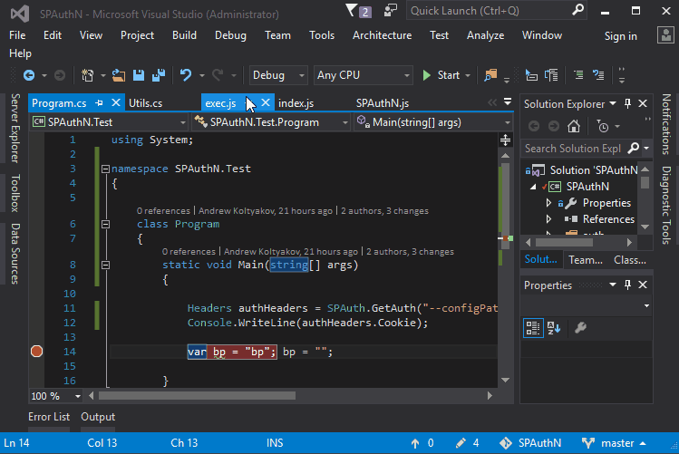
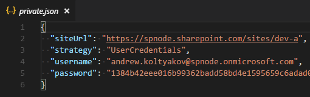

# SPAuthN - SharePoint .Net auth via Node.js

[](https://www.nuget.org/packages/SPAuthN)
[](https://www.nuget.org/packages/SPAuthN)
[](https://gitter.im/sharepoint-node/Lobby)

---

The wrapper for [node-sp-auth](https://www.npmjs.com/package/node-sp-auth) and [node-sp-auth-config](https://www.npmjs.com/package/node-sp-auth-config) for usage in .Net assemblies.

Allows authenticating in SharePoint in whatever you need scenarios and provides a wizard-like approach for building and managing connection config files.

---

Hey! Attention, please! On the first place, it is a crazy experiment which solves one of our very specific tasks for a frontier technology stack with SharePoint/Node.js/.Net where we need running the same exactly auth mechanisms which we use in Node.js but in .Net applications. We know exactly what we're doing and why. Please use the lib only in the case when native .Net credentials strategies do not suite your app.

## For whom is this library?

For folks who used to create applications for SharePoint with authentication level powered by `node-sp-auth-config` and `node-sp-auth-config` and who desire reuse authentication settings parameters and formats in .Net application.

For geeks from geeks passionated with funky technology experiments on their way doing awesome stuff.

For the cases when one tool should rule *all possible authentication strategies in SharePoint.

And definitely not for the situations when these work for you:

- context.Credentials = new SharePointOnlineCredentials("username", "securepass");
- context.Credentials = new NetworkCredential("username", "password", "domain");
- Any other native authentication routes.

## Supported SharePoint versions

- SharePoint Online
- SharePoint 2016
- SharePoint 2013

## Authentication strategies

- SharePoint Online:
  - Addin only permissions
  - SAML based with user credentials
  - ADFS user credentials
- SharePoint 2013, 2016:
  - Addin only permissions
  - User credentials through the http NTLM handshake
  - ADFS user credentials
  - Form-based authentication (FBA)
  - Forefront TMG authentication

## How to install

```PowerShell
Install-Package SPAuthN
```

## How to use

```csharp
Options options = SPAuth.GetAuth();
```

That's it! Really!

Now `options.headers` object contains Cookie or Authorization which can be injected to web requests.
This is a low level, session timeouts should be controlled manually.

## First run

During very first execution, node modules dependencies are installed. This can take a couple of seconds, second run doesn't need this process repetition so is much faster.

## Credentials

[node-sp-auth-config](https://github.com/koltyakov/node-sp-auth-config) is responsible for prompting auth strategy and credentials:



By default, after the propmpts are done `./config/private.json` file is created in the root folder of the app.



`GetAuth` checks for `./config/private.json` and continues without prompts if all needed for the strategy parameters are filled in.
Password is stored as a secure string, it can be used only on the machine where it was generated. Password can be rewritten in the config and it will be encrypted on next auth method run.

## Arguments

`GetAuth` method receives a string with arguments which are passed as initiators to [AuthConfigSettings](https://github.com/koltyakov/node-sp-auth-config/blob/master/src/interfaces/index.ts#L35).

```csharp
Options options = SPAuth.GetAuth("--encryptPassword=false --configPath='./config/private.uat.json'");
```

### Arguments use cases

#### Redefine private config file path

```bash
--configPath='./config/private.prod.json'
```

#### Disable password encryption

```bash
--encryptPassword=false
```

#### Disable saving private config on disc

```bash
--saveConfigOnDisk=false
```

#### Enforce parameters prompts

```bash
--forcePrompts=true
```

#### Raw auth options (example)

```bash
--authOptions.siteUrl="http://sharepoint" --authOptions.username="user@contoso.com" --authOptions.password="p@ssw0rd" --saveConfigOnDisk=false
```

### Usage examples

#### WebRequest

```csharp
Options options = SPAuth.GetAuth("--configPath='./config/private.json'");
HttpWebRequest request = (HttpWebRequest)WebRequest.Create(options.SiteUrl + "/_api/web?$select=Title");
Request.ApplyAuth(request, options);

request.Method = "GET";

HttpWebResponse response = (HttpWebResponse)request.GetResponse();

if (response.StatusCode == HttpStatusCode.OK || response.StatusCode == HttpStatusCode.NoContent)
{
  Stream dataStream = response.GetResponseStream();
  XDocument xDoc = XDocument.Load(dataStream);

  XNamespace ns = "http://www.w3.org/2005/Atom";
  XNamespace d = "http://schemas.microsoft.com/ado/2007/08/dataservices";
  XNamespace m = "http://schemas.microsoft.com/ado/2007/08/dataservices/metadata";

  string title = xDoc
    .Element(ns + "entry").Element(ns + "content")
    .Element(m + "properties").Element(d + "Title").Value;

  Console.WriteLine("REST | Web title is: {0}", title);

  dataStream.Close();
}

response.Close();
```

`request.Accept = "application/json; odata=verbose";` can/should be used to get data as JSON then deserialize response with NewtonSoft Json.NET for instance.

#### CSOM

```csharp
Options options = SPAuth.GetAuth("--configPath='./config/private.json'");
using (ClientContext clientContext = new ClientContext(options.SiteUrl))
{
  Request.ApplyAuth<WebRequestEventArgs>(clientContext, options);

  var web = clientContext.Web;
  clientContext.Load(web);
  clientContext.ExecuteQuery();

  Console.WriteLine("CSOM | Web title is: {0}", web.Title);
}
```